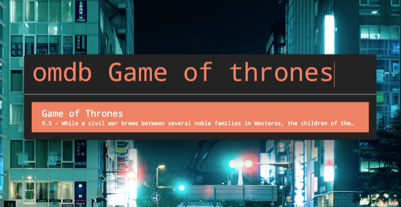

# dext-omdb-plugin

> [Dext](https://github.com/vutran/dext) plugin to search movies from [omdb](http://www.omdbapi.com/).



Although you are redirected to imdb, this plugin uses the omdbapi to search for movies.
imdb has not released an open-api as far as I am aware.

## Installation

```
$ dpm install dext-omdb-plugin
```
